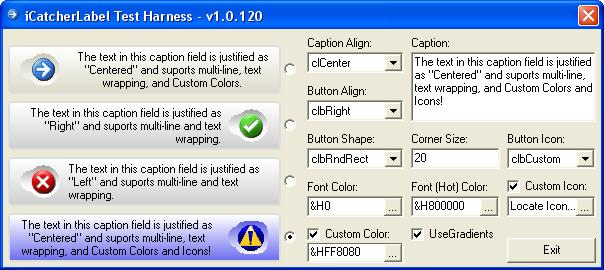



## iCatcherLabel Control

### Description

Does your application need a Label, Status, and Button control rolled into one? Want more visual appeal than the current Win9X themes? Then check out this iCatcherLabel control which provides all the functionality of a standard label control, with the added features of native graphical buttons that also serve as status icons. This self-subclassed, All API UserControl provides extensive events (15 events) for both the label and button objects, and provides more than 30 properties to control color, alignment, shape, and many more. If you looking for something different, then this might be for you&#8230;
 
### More Info
 

             |
---                |---
**Submitted On**   |2005-09-23 21:17:54
**By**             |[TerriTop](https://github.com/Planet-Source-Code/PSCIndex/blob/master/ByAuthor/territop.md)
**Level**          |Advanced
**User Rating**    |4.7 (61 globes from 13 users)
**Compatibility**  |VB 6\.0
**Category**       |[Custom Controls/ Forms/  Menus](https://github.com/Planet-Source-Code/PSCIndex/blob/master/ByCategory/custom-controls-forms-menus__1-4.md)
**World**          |[Visual Basic](https://github.com/Planet-Source-Code/PSCIndex/blob/master/ByWorld/visual-basic.md)
**Archive File**   |[iCatcherLa1934919232005\.zip](https://github.com/Planet-Source-Code/territop-icatcherlabel-control__1-62663/archive/master.zip)

### API Declarations

Many!

